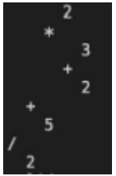

## 评估2：表达式二叉树

### 重要的

这项评估占JC1503面向对象编程课程总分的30%。这个评估有两个部分，代码和报告；代码部分占40分，报告部分占60分。

你必须在SCNU时间5月27日星期五23:00（GMT+8）之前提交你的代码和报告。请确保你的解决方案在那之前就可以运行。你必须将报告的pdf文件提交到名为 "Assessment 2 Report Submission"的文件夹中。你必须将你的代码文件压缩成zip格式，并将zip文件上传到名为 "Assessment 2 Code Submission"的文件夹中。

评卷人会看你的代码，并目测其输出。如果代码不能运行，或者输出与预期的有很大不同，你将得到一个更低的分数。请记住，由于这是一项个人评估，提交的作品必须是你自己的。如果你还没有这样做，你应该熟悉大学关于抄袭的指导，可在 https://www.abdn.ac.uk/sls/online-resources/avoiding-plagiarism/ 查阅。

如果你重复使用其他人的代码或库，你必须在你的代码中明确提到这一点并承认他们的工作。这包括：

- 你从哪里获得它们（例如，URL、书籍、GitHub）？
- 谁是作者？当然，他们不可能是你的同学！！
- 你是如何修改它们的？特别是，如果你对别人的一段代码做了微小的改动，你必须在你的代码中清楚地标明哪一部分是你自己的代码。

### 介绍

In Q1 of JC1503 Practical on Trees (Practical 10), you were given the following expression:

在JC1503关于树的实践（实践10）的Q1中，你得到了以下表达式：
$$
(((5+2)*(2-1))/((2+9)+((7-2)-1))*8)
$$
并被要求将其转换为二叉树。

在这个评估中，要求你设计一个python程序，在用户输入一个数学表达式后，能够自动将其转换为 二叉树。具体来说，表达式的格式必须与上面的相同，一个有效的表达式可以被递归定义如下。

它的形式必须是`(X?Y)`，其中X和Y是数字或有效的表达式，而`?` 代表运算符`(*, /, +, -)`

例如：

`(4*5)`是一个有效的表达式；

`((2*3)*5)`和`((2*4)*(5*6))`也是有效表达；

`(4*5*6)`不是一个有效的表达式，因为它在一对括号内有三个操作数；`((4*(5+6)`不是一个有效的表达式，因为括号不匹配（缺少最后的括号）。

为了简化问题，我们假设所有数字都是个位数（即从0到9），所有运算符都是：`*, /, +, -`

**提示**：你可能想使用各种数据结构的组合，例如，堆栈和树。

**Tests**

为你的代码编写测试是一种良好的做法。因此，一些单元测试应该包含在你的代码中，以显示它们的用途，并确认你的数据结构持有预期值。

**提示**：测试数据结构，而不是输出到屏幕上，因为单元测试控制台输出具有挑战性

### 代码的评分标准

1. 如果你的程序运行了，那就是4分；如果它运行了，但只做了一些解析，那就是6分。如果它既能运行，又能将输入的内容评估为有效的表达式，那就是8分。[8分］

   例如，给定的输入字符串：`(((2*(3+2))+5)/2)`

   计算出来的结果将是：7.5

   请注意，这个例子是为了说明问题，在评分过程中，将使用不同的字符串来测试你的解决方案。

2. 你的程序可以在终端中直观地看到生成的二进制树的输出。如果它的遍历代码有一些错误，那么这就是4分，如果它工作正常，那么这就是6分。[ 6分 ]

   使用中序遍历对输入的预期输出树如下（你可以把它打印在屏幕上，如果不方便，你不需要打印连接树节点的线）：

   

   如果你想象它向右倾斜90度，你就能读懂这棵树。这使得"/"成为树的根部，而且与讲座不同的是，我们从右到左阅读这棵树。

3. 你的程序可以将二叉树保存到一个文件中。在你退出你的程序后，你可以重新启动你的程序，将树从同一个文件中重新加载到内存中，并再次将其可视化。如果你能将树保存到一个文件中，那么这就是4分。如果你能保存，并将文件读回，那么这就是6分。[6分］

   提示：你可以考虑使用 pickle 包来实现序列化。你也可以使用其他的包，或者你可以写自己的函数来进行序列化。

4. 你的程序可以另外报告表达式无效的原因。如果你有一些关于无效表达式的报告，那么这就是4分。如果你有一个更广泛的报告清单，比如说下面，那么就是6分。[ 6分 ]

   `(4*3*2)` Not a valid expression, wrong number of operands.

   `(4*(2))` Not a valid expression, wrong number of operands.

   `(4*(3+2)*(2+1))` Not a valid expression, wrong number of operands.

   `(2*4)*(3+2)` Not a valid expression, brackets mismatched.

   `((2+3)*(4*5)` Not a valid expression, brackets mismatched.

   `(2+5)*(4/(2+2)))` Not a valid expression, bracket mismatched.

   `(((2+3)*(4*5))+(1(2+3)))` Not a valid expression, operator missing.

   

5. 你的代码包括一些单元测试。如果有工作测试，那么这就是4分。如果测试符合下面的标准，那就是6分。[6分］

   测试名称是有解释的，有明确的测试，而且它们的存在是有意义的。

6. 遵循合理的编码规则。以下每项应得2分。[8pt]

   你应该遵循合适的编码惯例：

   - 代码易于阅读；自我描述的方法名称，显示了意图，方法简短，控制流程清晰。
   - 注释中说你为什么要做某事，并在适当时包括参考资料。
   - 你的代码是可维护的，不包括死的代码，这些代码永远不会到达，也不会被使用，并且以可理解的方式进行模块化。
   - 在文件的顶部有一个 "readme "注释部分，解释了如何运行该应用程序（和任何测试），以及任何其他相关信息。

上传到评估2的pdf报告应包含：

1. 目录页
2.  申请书的基本设计（600字），包括：
   - 对申请的书面说明。
   - 对所有六项任务的实施进行评论。
3. 对你为应用程序所做的算法选择的描述（600字），包括：
   -  为你的程序/应用选择和实现特定和/或具体数据结构的理由
   - 对你的程序/应用所使用的类/子类的描述和理由。
   - 提供你在程序/应用中使用的单元测试或其他测试的片段。 描述并评论这些测试的结果。
4.  参考文献列表，显示你在学习中使用的项目，并在报告正文中正确引用。

### 报告的评分方案

1. 一份基本的报告，解释了应用程序的操作以及数据结构的选择和编程选择，但没有详细说明结构和/或选择和/或单元测试。该报告可能不包含正确的部分。[通过]。
2. 该报告解释了应用程序的操作和结构。对数据结构的选择、编程选择和代码中使用的单元测试进行了评估和简要讨论。报告的格式是正确的。[好］
3.  该报告详细介绍了应用程序的操作和结构。对代码中使用的数据结构、编程选择和单元测试的选择进行了解释和说明。报告的格式正确。[非常好］
4. 该报告全面详述了该应用程序的操作和结构。对应用程序中使用的数据结构、编程选择和单元测试的选择进行了充分解释，并对其在该应用程序中的使用进行了评估。报告的格式是正确的。通过报告的全面性，可以在这一部分获得更高的分数。[优秀］

### 最后说明

请记住，由于这是一项个人评估，所提交的工作必须是你自己的。如果你还没有这样做，你应该熟悉大学关于抄袭的指导，可在以下网址查询：https://www.abdn.ac.uk/sls/online-resources/avoiding-plagiarism/

1. 你的代码将被一个软件抄袭检查器进一步检查。如果存在抄袭行为，你的分数可能会被改为较低的分数，甚至是零分。如果发生这种情况，课程协调员会通知你。
2. 如果你重新使用其他人的代码或库，你必须在你的代码中明确提到这一点并承认他们的工作。这包括：
   - 你从哪里获得它们（例如，URL、书籍、GitHub）？
   - 谁是作者？当然，他们不可能是你的同学！！
   - 你是如何修改它们的？特别是，如果你对别人的一段代码做了微小的改动，你必须在你的代码中清楚地标明哪一部分是你自己的代码，哪一部分是他们的。

关于Python文档，请参见以下指南：

[Documentation — The Hitchhiker's Guide to Python (python-guide.org)](https://docs.python-guide.org/writing/documentation/)